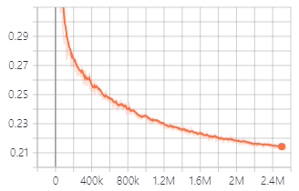

# Based on the original HiFi-GAN [paper](https://arxiv.org/abs/2010.05646) and [repo](https://github.com/jik876/hifi-gan): 
# HiFi-GAN: Generative Adversarial Networks for Efficient and High Fidelity Speech Synthesis
### Jungil Kong, Jaehyeon Kim, Jaekyoung Bae


## Pre-requisites
1. Python >= 3.6
2. Clone this repository.
3. Install python requirements. Please refer [requirements.txt](requirements.txt)
4. Download and extract the [LJ Speech dataset](https://keithito.com/LJ-Speech-Dataset/).
And move all wav files to `LJSpeech-1.1/wavs`

## Preprocessing for flac files

VCTK dataset has flac format which needs to be transformed to wav and then downsampled to ~22kHz:
```
python preprocess_flac.py --input_dir="/input_dir/" --output_dir="/output_dir/" --sample_rate=22050
```
Then one can use ```inference.py``` from below to compare the original wav with the generated one.


## Training
```
python train.py --config config_v1.json
```
To train V2 or V3 Generator, replace `config_v1.json` with `config_v2.json` or `config_v3.json`.<br>
Checkpoints and copy of the configuration file are saved in `cp_hifigan` directory by default.<br>
You can change the path by adding `--checkpoint_path` option.

Validation loss during training with V1 generator.<br>


## Pretrained Model
You can also use pretrained models we provide.<br/>
[Download pretrained models](https://drive.google.com/drive/folders/1-eEYTB5Av9jNql0WGBlRoi-WH2J7bp5Y?usp=sharing)<br/> 
Details of each folder are as in follows:

|Folder Name|Generator|Dataset|Fine-Tuned|
|------|---|---|---|
|LJ_V1|V1|LJSpeech|No|
|LJ_V2|V2|LJSpeech|No|
|LJ_V3|V3|LJSpeech|No|
|LJ_FT_T2_V1|V1|LJSpeech|Yes ([Tacotron2](https://github.com/NVIDIA/tacotron2))|
|LJ_FT_T2_V2|V2|LJSpeech|Yes ([Tacotron2](https://github.com/NVIDIA/tacotron2))|
|LJ_FT_T2_V3|V3|LJSpeech|Yes ([Tacotron2](https://github.com/NVIDIA/tacotron2))|
|VCTK_V1|V1|VCTK|No|
|VCTK_V2|V2|VCTK|No|
|VCTK_V3|V3|VCTK|No|
|UNIVERSAL_V1|V1|Universal|No|

We provide the universal model with discriminator weights that can be used as a base for transfer learning to other datasets.

## Fine-Tuning
1. Generate mel-spectrograms in numpy format using [Tacotron2](https://github.com/NVIDIA/tacotron2) with teacher-forcing.<br/>
The file name of the generated mel-spectrogram should match the audio file and the extension should be `.npy`.<br/>
Example:
    ```
    Audio File : LJ001-0001.wav
    Mel-Spectrogram File : LJ001-0001.npy
    ```
2. Create `ft_dataset` folder and copy the generated mel-spectrogram files into it.<br/>
3. Run the following command.
    ```
    python train.py --fine_tuning True --config config_v1.json
    ```
    For other command line options, please refer to the training section.


## Inference from wav file
1. Make `test_files` directory and copy wav files into the directory.
2. Run the following command.
    ```
    python inference.py --checkpoint_file [generator checkpoint file path]
    ```
MELs are automatically generated and fed through the generator. 
Generated wav files are saved in `generated_files` by default.<br>
You can change the path by adding `--output_dir` option.


## Inference for end-to-end speech synthesis
1. Make `test_mel_files` directory and copy generated mel-spectrogram files into the directory.<br>
You can generate mel-spectrograms using [Tacotron2](https://github.com/NVIDIA/tacotron2), 
[Glow-TTS](https://github.com/jaywalnut310/glow-tts) and so forth.
2. Run the following command.
    ```
    python inference_e2e.py --checkpoint_file [generator checkpoint file path]
    ```
Generated wav files are saved in `generated_files_from_mel` by default.<br>
You can change the path by adding `--output_dir` option.


## Acknowledgements
We referred to [WaveGlow](https://github.com/NVIDIA/waveglow), [MelGAN](https://github.com/descriptinc/melgan-neurips) 
and [Tacotron2](https://github.com/NVIDIA/tacotron2) to implement this.

